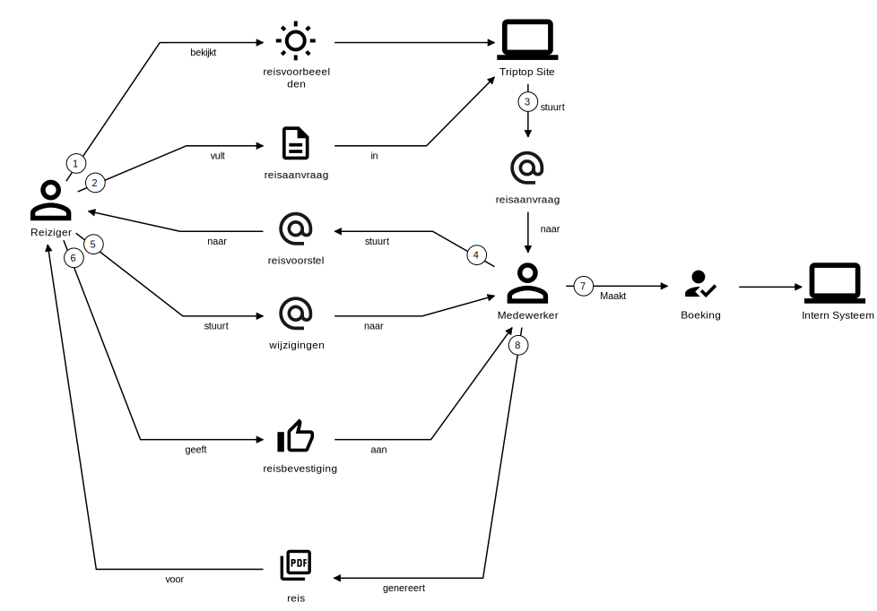
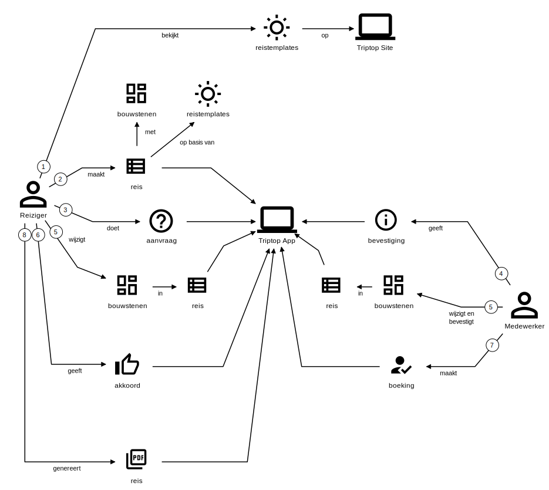

# Software Guidebook Triptop

## 1. Introduction
Dit software guidebook geeft een overzicht van de Triptop-applicatie. Het bevat een samenvatting van het volgende: 
1. De vereisten, beperkingen en principes. 
1. De software-architectuur, met inbegrip van de technologiekeuzes op hoog niveau en de structuur van de software. 
1. De ontwerp- en codebeslissingen die zijn genomen om de software te realiseren.
1. De architectuur van de infrastructuur.

## 2. Context

> [!IMPORTANT]  
> Werk zelf dit hoofdstuk uit met context diagrammen en een beschrijving van de context van de software.

Toelichting op de context van de software inclusief System Context Diagram:
* Functionaliteit
* Gebruikers
* Externe systemen

## 3. Functional Overview

Triptop is een applicatie waarmee reizigers en medewerkers van een reisbureau gezamenlijk een reis kunnen samenstellen en beheren. Een reis bestaat uit een aantal dagen en op elke dag kan ingevuld worden aan de hand van verschillende soorten bouwstenen (bijvoorbeeld vervoer, verblijf en activiteiten). De applicatie helpt assisteert bij het komen tot een haalbare reis die zoveel mogelijk voldoet aan de wensen van de reiziger.

### 3.1 Domain Stories

#### 3.1.1 Reis boeken as is

Hieronder is het proces van het uitzoeken van een reis tot aan het boeken weergegeven zoals dit op dit moment gaat.

Omdat we ons in deze fase richten op het samenstellen van de reis, is het daadwerkelijk betalen en uitvoeren van de reis niet opgenomen.

Activities 1 en 2 zijn vinden volledig plaats op de Triptop website en het invullen van een reisaanvraag gaat via een formuliertje op deze site

De andere activities (behalve 7) gaan allemaal via de e-mail en activities 4 en 5 worden normaal gesproken een aantal keren uitgevoerd. Het gebruik van e-mail is daarom ook onhandig voor zowel Reiziger als Medewerker

Activity 6 is het moment waarop een Reiziger de reis vastlegt en een betalingsverplichting aangaat.

Activity 7 is toegevoegd ter illustratie en verdere interactie met het Interne Systeem zijn voor nu niet relevant. 

#### 3.1.2 Reis boeken to be

Hieronder is het proces van het uitzoeken van een reis tot aan het boeken weergegeven zoals dit zou moeten gaan met de Triptop App. 

Zoals te zien gaat alle communicatie over de reis nu via de app en er is geen extern kanaal, zoals e-mail, meer nodig. 

Ook is te zien dat een reis uit flexibele bouwstenen gaat bestaan.

Bij activities 1 en 2 is er nog geen Medewerker van het reisbureau betrokken. Hierdoor kunnen reizigers vrijblijvend ideeën verzamelen over een mogelijke reis, zonder dat er een medewerker naar hoeft te kijken. 

In activities 3 en 4 geeft een Reiziger aan serieus geïnteresseerd te zijn in een reis en wordt er een Medewerker aan de reis gekoppeld. 

Activity 5 geeft aan dat Reizigers en Medewerkers tegelijkertijd de bouwstenen van een reis kunnen bewerken. Deze activity herhaalt zich waarschijnlijk een aantal keer. Hoe dit proces er precies uit ziet en welke gebruiker welke bewerkingsmogelijkheden heeft moet nog verder worden uitgezocht. 

Met activities 6 en 7 geeft een Reiziger commitment met betalingsverplichting en wordt dit geregistreerd. Waarschijnlijk zijn hier nog andere systemen bij betrokken, maar die zijn voor nu niet relevant.

In de toekomst is het wenselijk dat Reizigers bouwstenen van de reis, of zelfs de hele reis, ook kunnen boeken zonder tussenkomst van de medewerker van het reisbureau. Hoe dit er precies uit zou moeten zien, wordt later pas bepaald.

Activity 8 laat zien dat een Reiziger nu zelf een pdf van de reis kan maken als dat gewenst is.

#### 3.2 Begrippenlijst

> [!IMPORTANT]  
> Maak zelf een begrippenlijst op basis van de opdracht en de domain stories

#### 3.3 Domain Model

> [!IMPORTANT]  
> Maak zelf een domeinmodel op basis van de opdracht en de domain stories en plaats deze hier samen met motivatie van keuzes in het model.

#### Features Walking Skeleton

Het walking skeleton is een versimpelde versie van het uiteindelijke product en bevat de onderstaande features.

1. Klanten en Medewerkers kunnen bouwstenen toevoegen en verwijderen.
1. Een medewerker kan een reis finaliseren, waarna deze niet meer aangepast kan worden.

Hieronder is een domein story weergegeven waarin de bovenstaande features te zien zijn:

#### 3.4 Wireframes

> [!IMPORTANT]  
> Plaats hier de (mock-ups) van de wireframes die je hebt gemaakt met uitleg 

## 4. Quality Attributes

In dit project zijn de onderstaande kwaliteitsattributen belangrijk. Deze zijn afgeleid van de ISO 25010 kwaliteitsattributen. 

We willen weten in hoeverre de onderstaande kwaliteitsattributen implementeerbaar is en wat de consequenties zijn van attributen. Ook willen we weten welke knelpunten we eventueel tegenkomen.

https://www.iso25000.com/index.php/en/iso-25000-standards/iso-25010

De onderstaande lijst met kwaliteitsattributen zijn aan het begin samen met de opdrachtgever opgesteld.  

### Maintainability > Modularity 

De applicatie bestaat zoveel mogelijk uit aparte componenten die onafhankelijk van elkaar kunnen worden ontwikkeld en getest. De domeinlogica moet in ieder geval onafhankelijk zijn van alle andere onderdelen.

### Maintainability > Modifiability 

Er moeten nieuwe typen bouwstenen kunnen worden toegevoegd zonder dat de bestaande code aangepast hoeft te worden. 

### Functional Suitability > Functional Correctness & Appropriateness

Wanneer twee gebruikers een reis bewerken, dan moet de applicatie ervoor zorgen dat de reis consistent blijft en dat de wijzigingen van de ene gebruiker zo min mogelijk ten kosten gaan van de wijzigingen van de andere gebruiker.

### Interaction Capability  > Operability

Wijzigingen in de reis moeten direct bij de andere klant zichtbaar zijn zonder dat de pagina opnieuw geladen hoeft te worden.

### Security > Confidentiality 

Een reis met alle bijbehorende bouwstenen mag alleen bekeken en aangepast worden door de klanten die aan de reis zijn gekoppeld en door de medewerker van Triptop die aan de reis is gekoppeld. 

### Flexibility > Scalability & Replaceability

Het authenticatie/autorisatie-onderdeel en het websockets-onderdeel van de triptop applicatie moeten zo los mogelijk van de triptop applicatie staan. Er zijn plannen om deze onderdelen ook te gebruiken voor andere applicaties waardoor ze los van de Triptop-applicatie geschaald moeten worden. Daarnaast moet het mogelijk zijn om deze onderdelen te vervangen zonder bestaande code aan te passen.

## 5. Constraints

We willen in eerste instantie zo min mogelijk afhankelijkheden zijn van libraries en frameworks, zodat we kunnen ervaren of we tegen belangrijke obstakels lopen. Daarom gelden de onderstaande constraints: 

- Het project wordt in JavaScript geschreven (dus geen TypeScript).
- De frontend wordt in Vanilla JavaScript geschreven (http://vanilla-js.com/)
- De backend wordt volledig in Deno geschreven, waarbij gebruik gemaakt van de Dene standard libraries 

Daarnaast zijn de onderstaande technologieën in dit project voorgeschreven:

- **WebSockets** voor realtime communicatie tussen frontend en backend.
- **JWT** voor autorisatie en authenticatie.
- **Deno KV store** voor de database.

Voor een aantal functionaliteiten zijn de volgende API's voorgeschreven:

- **Leaflet** (https://leafletjs.com/) voor het tonen van locaties op een kaart in de browser
- **Open Route Service** (https://openrouteservice.org/) voor het bepalen van routes tussen verschillende plaatsen
- **Stripe Payment** (https://stripe.com/en-nl) voor het betalen van de reis

> [!IMPORTANT]  
> Beschrijf zelf de beperkingen die op voorhand bekend zijn die invloed hebben op keuzes die wel of niet gemaakt kunnen of mogen worden.

## 6. Principles

### Domain Driven Design

De applicatie moet gebruikt de tactical patterns uit DDD waaronder Value Objects, Entities, Aggregates en Repositories. Alle concurency-problemen die optreden bij het gelijktijdig bewerken van een reis lossen we op met het gebruik van aggregates en optimistic locking.

### Domain-Expressive Communication

Berichten tussen onderdelen van de applicatie moeten zoveel mogelijk concepten en begrippen uit het domein gebruiken.

### UI als pure functie van de state

De gebruikersinterface om een trip aan te passen, wordt opgebouwd als een directe functie van de huidige UI-state. De opbouw van de trip-UI (bijvoorbeeld de lijst van reis- en verblijfcomponenten) moet volledig worden aangestuurd door een, of meerdere JavaScript-objecten die de trip-state bevatten. 

> [!IMPORTANT]  
> Voeg toe: de ontwerpprincipes die je hebt onderzocht.
> 
> Voeg ook toe of alle principes toepasbaar zijn, of dat we principes moeten afwegen tegen elkaar, of tegen quality attributes.

## 7. Software Architecture

### 7.1. Containers

> [!IMPORTANT]  
> Voeg toe: Container Diagram plus een Dynamic Diagram van een aantal scenario's inclusief begeleidende tekst.

### 7.2. Components

> [!IMPORTANT]  
> Voeg toe: Component Diagram plus een Dynamic Diagram van een aantal scenario's inclusief begeleidende tekst.

### 7.3. Design & Code

> [!IMPORTANT]
> Voeg toe: Per ontwerpvraag een Class Diagram plus een Sequence Diagram van een aantal scenario's inclusief begeleidende tekst.

## 8. Data

### 8.1 Datamodel Backend

> [!IMPORTANT]
> Plaats hier het domeinmodel met een indeling in aggregates. Beschrijf daarbij welke invarianten je met deze indeling afdekt   

### 8.2 Datamodel Frontend

> [!IMPORTANT]
> Laat hier het datamodel zien dat je gebruikt voor de bouwstenen en de trip aan de frontend

### 8.3 Datamodel REST 

> [!IMPORTANT]
> Geef hier de REST routes en de berichten die teruggestuurd worden. Je kunt ook een link naar de Swagger-documentatie geven

### 8.4 Datamodel WebSockets

> [!IMPORTANT]
> Benoem hier de berichten en de data die je over websockets stuurt.

## 9. Architectural Decision Records

> [!IMPORTANT]  
> Voeg toe: 3 tot 5 ADR's die beslissingen beschrijven die zijn genomen tijdens het ontwerpen en bouwen van de software.

### 9.1. ADR-001 TITLE

> [!TIP]  
> These documents have names that are short noun phrases. For example, "ADR 1: Deployment on Ruby on Rails 3.0.10" or "ADR 9: LDAP for Multitenant Integration". The whole ADR should be one or two pages long. We will write each ADR as if it is a conversation with a future developer. This requires good writing style, with full sentences organized into paragraphs. Bullets are acceptable only for visual style, not as an excuse for writing sentence fragments. (Bullets kill people, even PowerPoint bullets.)

#### Status

> [!TIP]  
> A decision may be "proposed" if the project stakeholders haven't agreed with it yet, or "accepted" once it is agreed. If a later ADR changes or reverses a decision, it may be marked as "deprecated" or "superseded" with a reference to its replacement.

#### Context 

> [!TIP]  
> This section describes the forces at play, including technological, political, social, and project local. These forces are probably in tension, and should be called out as such. The language in this section is value-neutral. It is simply describing facts about the problem we're facing and points out factors to take into account or to weigh when making the final decision.

## Considered Options

> [!TIP]  
> This section mentions the possible options as headers in the second, third, etc. column. The forces in the left column are criteria (requirements, quality attributes, other forces like costs, learning curve, cultural, political or ethical factors that we can use to make the decision. 

| Forces                                        |  Aspect 1 << decided >>      |  Aspect 2 << discarded >>             |
|-----------------------------------------------|----------------------------|--------------------------------------|
| Force 1 (ASR of aanvullende force)            |   --/-/?/+/++ (incl. bron) |    --/-/?/+/++ (incl. bron)          |
| Force 2 (ASR of aanvullende force)            |   --/-/?/+/++ (incl. bron) |    --/-/?/+/++  (incl. bron)         |
| Force 3 (ASR of aanvullende force)            |   --/-/?/+/++ (incl. bron) |    --/-/?/+/++  (incl. bron)         |
| Force 4 (ASR of aanvullende force)            |   --/-/?/+/++ (incl. bron) |    --/-/?/+/++  (incl. bron)         |

#### Decision

> [!TIP]  
> This section describes our response to the forces/problem. It is stated in full sentences, with active voice. "We decided to use option X because of …"

#### Consequences 

> [!TIP]  
> This section describes the resulting context, after applying the decision. All consequences should be listed here, not just the "positive" ones. A particular decision may have positive, negative, and neutral consequences, but all of them affect the team and project in the future.

### 9.2. ADR-002 TITLE

> [!TIP]  
> These documents have names that are short noun phrases. For example, "ADR 1: Deployment on Ruby on Rails 3.0.10" or "ADR 9: LDAP for Multitenant Integration". The whole ADR should be one or two pages long. We will write each ADR as if it is a conversation with a future developer. This requires good writing style, with full sentences organized into paragraphs. Bullets are acceptable only for visual style, not as an excuse for writing sentence fragments. (Bullets kill people, even PowerPoint bullets.)

#### Status

> [!TIP]  
> A decision may be "proposed" if the project stakeholders haven't agreed with it yet, or "accepted" once it is agreed. If a later ADR changes or reverses a decision, it may be marked as "deprecated" or "superseded" with a reference to its replacement.

#### Context

> [!TIP]  
> This section describes the forces at play, including technological, political, social, and project local. These forces are probably in tension, and should be called out as such. The language in this section is value-neutral. It is simply describing facts about the problem we're facing and points out factors to take into account or to weigh when making the final decision.

## Considered Options

> [!TIP]  
> This section mentions the possible options as headers in the second, third, etc. column. The forces in the left column are criteria (requirements, quality attributes, other forces like costs, learning curve, cultural, political or ethical factors that we can use to make the decision.

| Forces                                        |  Aspect 1 << decided >>      |  Aspect 2 << discarded >>             |
|-----------------------------------------------|----------------------------|--------------------------------------|
| Force 1 (ASR of aanvullende force)            |   --/-/?/+/++ (incl. bron) |    --/-/?/+/++ (incl. bron)          |
| Force 2 (ASR of aanvullende force)            |   --/-/?/+/++ (incl. bron) |    --/-/?/+/++  (incl. bron)         |
| Force 3 (ASR of aanvullende force)            |   --/-/?/+/++ (incl. bron) |    --/-/?/+/++  (incl. bron)         |
| Force 4 (ASR of aanvullende force)            |   --/-/?/+/++ (incl. bron) |    --/-/?/+/++  (incl. bron)         |

#### Decision

> [!TIP]  
> This section describes our response to the forces/problem. It is stated in full sentences, with active voice. "We decided to use option X because of …"

#### Consequences

> [!TIP]  
> This section describes the resulting context, after applying the decision. All consequences should be listed here, not just the "positive" ones. A particular decision may have positive, negative, and neutral consequences, but all of them affect the team and project in the future.

### 9.3. ADR-003 TITLE

> [!TIP]  
> These documents have names that are short noun phrases. For example, "ADR 1: Deployment on Ruby on Rails 3.0.10" or "ADR 9: LDAP for Multitenant Integration". The whole ADR should be one or two pages long. We will write each ADR as if it is a conversation with a future developer. This requires good writing style, with full sentences organized into paragraphs. Bullets are acceptable only for visual style, not as an excuse for writing sentence fragments. (Bullets kill people, even PowerPoint bullets.)

#### Status

> [!TIP]  
> A decision may be "proposed" if the project stakeholders haven't agreed with it yet, or "accepted" once it is agreed. If a later ADR changes or reverses a decision, it may be marked as "deprecated" or "superseded" with a reference to its replacement.

#### Context

> [!TIP]  
> This section describes the forces at play, including technological, political, social, and project local. These forces are probably in tension, and should be called out as such. The language in this section is value-neutral. It is simply describing facts about the problem we're facing and points out factors to take into account or to weigh when making the final decision.

## Considered Options

> [!TIP]  
> This section mentions the possible options as headers in the second, third, etc. column. The forces in the left column are criteria (requirements, quality attributes, other forces like costs, learning curve, cultural, political or ethical factors that we can use to make the decision.

| Forces                                        |  Aspect 1 << decided >>      |  Aspect 2 << discarded >>             |
|-----------------------------------------------|----------------------------|--------------------------------------|
| Force 1 (ASR of aanvullende force)            |   --/-/?/+/++ (incl. bron) |    --/-/?/+/++ (incl. bron)          |
| Force 2 (ASR of aanvullende force)            |   --/-/?/+/++ (incl. bron) |    --/-/?/+/++  (incl. bron)         |
| Force 3 (ASR of aanvullende force)            |   --/-/?/+/++ (incl. bron) |    --/-/?/+/++  (incl. bron)         |
| Force 4 (ASR of aanvullende force)            |   --/-/?/+/++ (incl. bron) |    --/-/?/+/++  (incl. bron)         |

#### Decision

> [!TIP]  
> This section describes our response to the forces/problem. It is stated in full sentences, with active voice. "We decided to use option X because of …"

#### Consequences

> [!TIP]  
> This section describes the resulting context, after applying the decision. All consequences should be listed here, not just the "positive" ones. A particular decision may have positive, negative, and neutral consequences, but all of them affect the team and project in the future.

### 9.4. ADR-004 TITLE

> [!TIP]  
> These documents have names that are short noun phrases. For example, "ADR 1: Deployment on Ruby on Rails 3.0.10" or "ADR 9: LDAP for Multitenant Integration". The whole ADR should be one or two pages long. We will write each ADR as if it is a conversation with a future developer. This requires good writing style, with full sentences organized into paragraphs. Bullets are acceptable only for visual style, not as an excuse for writing sentence fragments. (Bullets kill people, even PowerPoint bullets.)

#### Status

> [!TIP]  
> A decision may be "proposed" if the project stakeholders haven't agreed with it yet, or "accepted" once it is agreed. If a later ADR changes or reverses a decision, it may be marked as "deprecated" or "superseded" with a reference to its replacement.

#### Context

> [!TIP]  
> This section describes the forces at play, including technological, political, social, and project local. These forces are probably in tension, and should be called out as such. The language in this section is value-neutral. It is simply describing facts about the problem we're facing and points out factors to take into account or to weigh when making the final decision.

## Considered Options

> [!TIP]  
> This section mentions the possible options as headers in the second, third, etc. column. The forces in the left column are criteria (requirements, quality attributes, other forces like costs, learning curve, cultural, political or ethical factors that we can use to make the decision.

| Forces                                        |  Aspect 1 << decided >>      |  Aspect 2 << discarded >>             |
|-----------------------------------------------|----------------------------|--------------------------------------|
| Force 1 (ASR of aanvullende force)            |   --/-/?/+/++ (incl. bron) |    --/-/?/+/++ (incl. bron)          |
| Force 2 (ASR of aanvullende force)            |   --/-/?/+/++ (incl. bron) |    --/-/?/+/++  (incl. bron)         |
| Force 3 (ASR of aanvullende force)            |   --/-/?/+/++ (incl. bron) |    --/-/?/+/++  (incl. bron)         |
| Force 4 (ASR of aanvullende force)            |   --/-/?/+/++ (incl. bron) |    --/-/?/+/++  (incl. bron)         |

#### Decision

> [!TIP]  
> This section describes our response to the forces/problem. It is stated in full sentences, with active voice. "We decided to use option X because of …"

#### Consequences

> [!TIP]  
> This section describes the resulting context, after applying the decision. All consequences should be listed here, not just the "positive" ones. A particular decision may have positive, negative, and neutral consequences, but all of them affect the team and project in the future.

### 9.5. ADR-005 TITLE

> [!TIP]  
> These documents have names that are short noun phrases. For example, "ADR 1: Deployment on Ruby on Rails 3.0.10" or "ADR 9: LDAP for Multitenant Integration". The whole ADR should be one or two pages long. We will write each ADR as if it is a conversation with a future developer. This requires good writing style, with full sentences organized into paragraphs. Bullets are acceptable only for visual style, not as an excuse for writing sentence fragments. (Bullets kill people, even PowerPoint bullets.)

#### Status

> [!TIP]  
> A decision may be "proposed" if the project stakeholders haven't agreed with it yet, or "accepted" once it is agreed. If a later ADR changes or reverses a decision, it may be marked as "deprecated" or "superseded" with a reference to its replacement.

#### Context

> [!TIP]  
> This section describes the forces at play, including technological, political, social, and project local. These forces are probably in tension, and should be called out as such. The language in this section is value-neutral. It is simply describing facts about the problem we're facing and points out factors to take into account or to weigh when making the final decision.

## Considered Options

> [!TIP]  
> This section mentions the possible options as headers in the second, third, etc. column. The forces in the left column are criteria (requirements, quality attributes, other forces like costs, learning curve, cultural, political or ethical factors that we can use to make the decision.

| Forces                                        |  Aspect 1 << decided >>      |  Aspect 2 << discarded >>             |
|-----------------------------------------------|----------------------------|--------------------------------------|
| Force 1 (ASR of aanvullende force)            |   --/-/?/+/++ (incl. bron) |    --/-/?/+/++ (incl. bron)          |
| Force 2 (ASR of aanvullende force)            |   --/-/?/+/++ (incl. bron) |    --/-/?/+/++  (incl. bron)         |
| Force 3 (ASR of aanvullende force)            |   --/-/?/+/++ (incl. bron) |    --/-/?/+/++  (incl. bron)         |
| Force 4 (ASR of aanvullende force)            |   --/-/?/+/++ (incl. bron) |    --/-/?/+/++  (incl. bron)         |

#### Decision

> [!TIP]  
> This section describes our response to the forces/problem. It is stated in full sentences, with active voice. "We decided to use option X because of …"

#### Consequences

> [!TIP]  
> This section describes the resulting context, after applying the decision. All consequences should be listed here, not just the "positive" ones. A particular decision may have positive, negative, and neutral consequences, but all of them affect the team and project in the future.
## 10. Deployment, Operation and Support

> [!IMPORTANT]  
> Beschrijf hier wat je moet doen om de walking skeleton en andere prototypes te installeren en te runnen.